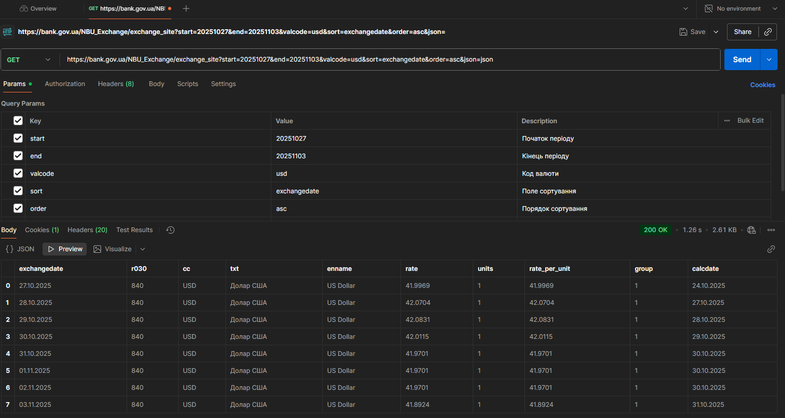
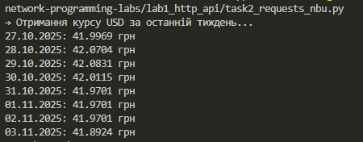
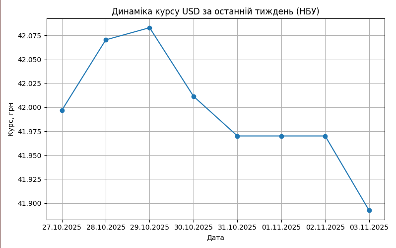
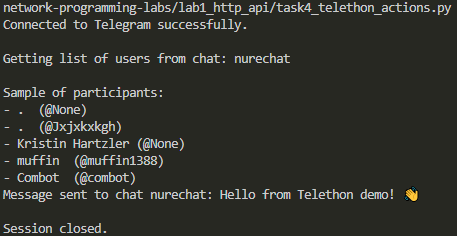
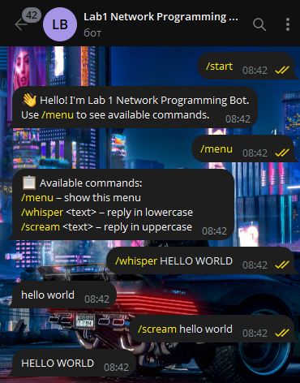

# Лабораторна робота №1  
## **Тема:** Робота з HTTP протоколом, запитами та публічними API  

### **Мета роботи:**  
Ознайомлення з принципами роботи протоколу **HTTP**, виконання запитів до **публічних API**, отримання та обробка даних у форматі **JSON**, побудова графіків за отриманими даними, робота з **Telegram API** через бібліотеки *Telethon* та *Aiogram*.

---

## Хід роботи


## Завдання 1. Отримання курсу валют із сайту НБУ (Postman)
**Інструмент:** [Postman](https://www.postman.com/)  

**API:**  
`https://bank.gov.ua/NBU_Exchange/exchange_site?start=YYYYMMDD&end=YYYYMMDD&valcode=usd&sort=exchangedate&order=asc&json`

**Результат:**  
Отримано дані про курс долара США (USD) до гривні за попередній тиждень.

  


---

## Завдання 2. Отримання курсу валют за допомогою Python (`requests`)
**Файл:** `task2_requests_nbu.py`  
**Основна бібліотека:** `requests`

```python
response = requests.get("https://bank.gov.ua/NBU_Exchange/exchange_site?start=...&end=...&valcode=usd&json")
data = response.json()
```




---

## Завдання 3. Побудова графіка зміни курсу (`matplotlib`)
**Файл:** `task3_plot.py`  

**Бібліотека:** `matplotlib`  

**Результат:**  Побудовано лінійний графік зміни курсу USD.



---

## Завдання 4. Робота з Telegram через Telethon
**Файл:** `task4_telethon_actions.py`  
**Бібліотеки:** `telethon`, `dotenv`

**Результат:**  Бот успішно підключається до Telegram, виводить список учасників і (за потреби) може надсилати повідомлення.



---

## Завдання 5. Telegram-бот (Aiogram)
**Файл:** `task5_telegram_bot.py`  

**Бібліотеки:** `aiogram`, `dotenv`  

**Приклад роботи бота:**

| Команда | Відповідь |
|----------|------------|
| `/start` | Hello! I'm Lab 1 Network Programming Bot. |
| `/menu` | Виводить список доступних команд |
| `/whisper HELLO WORLD` | hello world|
| `/scream hello world` | HELLO WORLD |



---

##  Висновки
У ході виконання лабораторної роботи було опрацьовано основи взаємодії з HTTP-протоколом та публічними API. За допомогою Python та інструменту Postman виконано запити до відкритого API НБУ, отримано та проаналізовано дані у форматі JSON.

На основі отриманих даних побудовано графік зміни курсу валют із використанням бібліотеки matplotlib, що дозволило закріпити навички візуалізації.

Також реалізовано роботу з Telegram API через бібліотеки Telethon та Aiogram — отримано список користувачів чату та створено Telegram-бота, який обробляє прості команди.

Робота дала змогу закріпити практичні знання з мережного програмування, обробки даних, роботи з API та створення Telegram-ботів мовою Python.


---

## 🧑‍💻 Автор
**Ім'я:** *Yaroslav*   
**Дата виконання:** 03.11.2025  