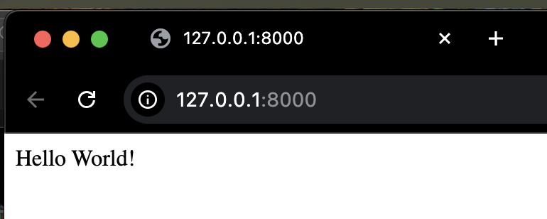
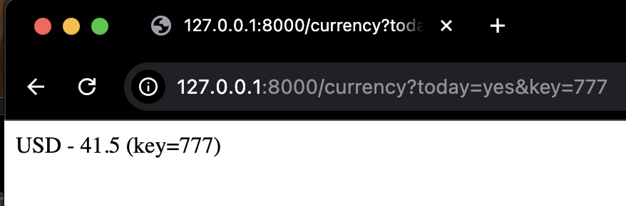
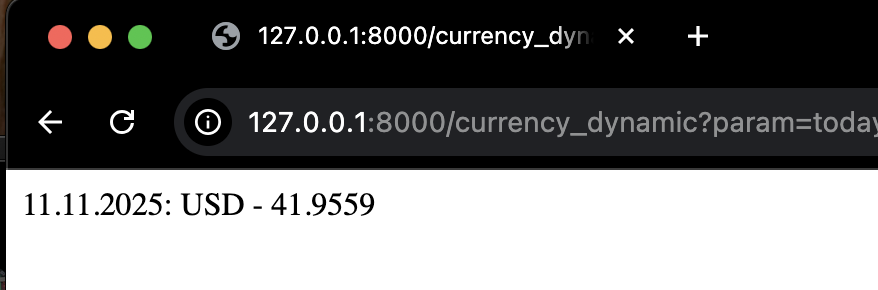
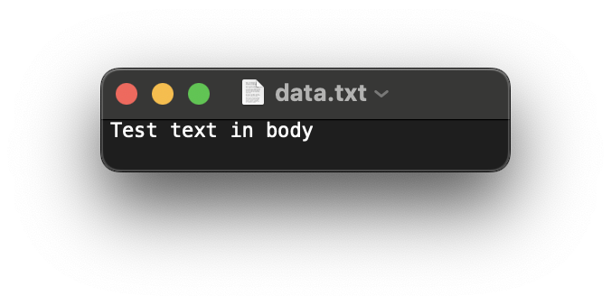
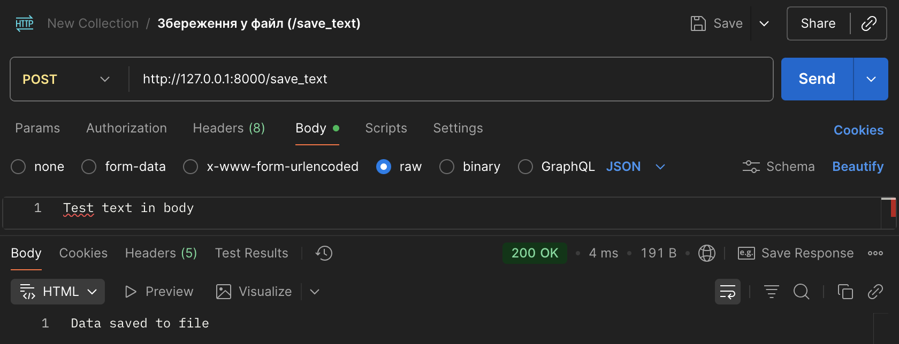
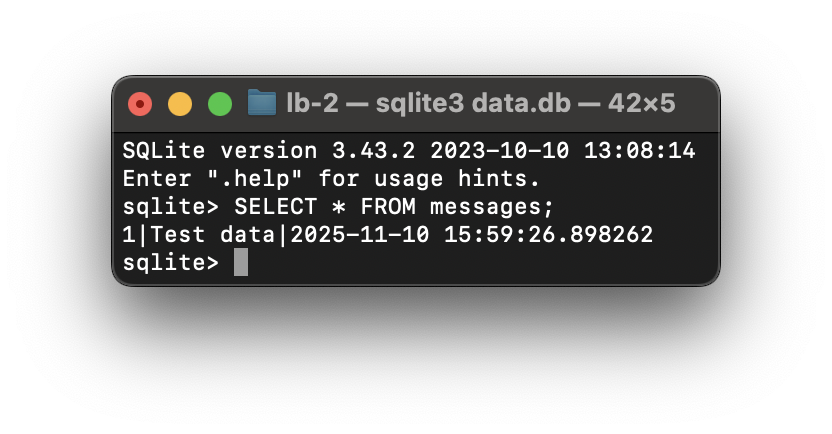

# Лабораторна робота №2

## **Тема:** Розробка веб-сервера на Flask. Робота з HTTP-запитами та публічними API

### **Мета роботи:**

Ознайомлення з принципами роботи веб-серверів на Python. Навчитися
обробляти HTTP-запити методів **GET** і **POST**, працювати з
параметрами URL та заголовками запиту, а також отримувати дані з
**публічних API (НБУ)**. Закріпити навички збереження даних у **файли**
та **бази даних (SQLite)**.

------------------------------------------------------------------------

## Хід роботи

------------------------------------------------------------------------

## Завдання 1. Створення Flask-сервера

**Файл:** `app.py`\
**Бібліотека:** `Flask`

``` python
from flask import Flask
app = Flask(__name__)

@app.route('/')
def hello_world():
    return "Hello World!"

if __name__ == '__main__':
    app.run(port=8000)
```

**Результат:**\
Після запуску сервера за адресою `http://127.0.0.1:8000/` у браузері
відображається повідомлення **"Hello World!"**



------------------------------------------------------------------------

## Завдання 2. Обробка GET-запиту з параметрами

``` python
from flask import request

@app.route('/currency')
def get_currency():
    today = request.args.get('today')
    key = request.args.get('key')
    if today:
        return f"USD - 41.5 (key={key})"
    return "Параметр 'today' не вказано."
```

**Результат:**\
GET-запит:\
`http://127.0.0.1:8000/currency?today&key=test`\
➡️ `USD - 41.5 (key=test)`



------------------------------------------------------------------------

## Завдання 3. Обробка заголовків запиту

``` python
from flask import jsonify, Response

@app.route('/headers')
def headers():
    content_type = request.headers.get('Content-Type', '')
    data = {"currency": "USD", "rate": 41.5}
    if content_type == "application/json":
        return jsonify(data)
    elif content_type == "application/xml":
        xml = f"<data><currency>{data['currency']}</currency><rate>{data['rate']}</rate></data>"
        return Response(xml, mimetype='application/xml')
    else:
        return f"Currency: {data['currency']}, Rate: {data['rate']}"
```

**Результат:**\
- `Content-Type: application/json` → JSON\
- `Content-Type: application/xml` → XML\
- Без заголовка → текст


------------------------------------------------------------------------

## Завдання 4. Отримання курсу валют із публічного API НБУ

``` python
import requests
from datetime import datetime, timedelta

@app.route('/currency_dynamic')
def currency_dynamic():
    param = request.args.get('param')
    if param == "today":
        url = "https://bank.gov.ua/NBUStatService/v1/statdirectory/exchange?valcode=USD&json"
    elif param == "yesterday":
        yesterday = (datetime.now() - timedelta(days=1)).strftime("%Y%m%d")
        url = f"https://bank.gov.ua/NBUStatService/v1/statdirectory/exchange?valcode=USD&date={yesterday}&json"
    else:
        return "Invalid parameter. Use ?param=today or ?param=yesterday."
    data = requests.get(url).json()[0]
    return f"{data['exchangedate']}: {data['cc']} – {data['rate']}"
```

**Результат:**\
`http://127.0.0.1:8000/currency_dynamic?param=today`\
➡️ `2025-11-10: USD – 41.52`



------------------------------------------------------------------------

## Завдання 5. POST-запит --- збереження у файл

``` python
@app.route('/save_text', methods=['POST'])
def save_text():
    text_data = request.data.decode('utf-8')
    with open('data.txt', 'a', encoding='utf-8') as f:
        f.write(text_data + '\n')
    return "Дані збережено у файл data.txt"
```

**Результат:**\
Тест у Postman (Body → raw → Text):

    Hello from Lab 2!

➡️ `Дані збережено у файл data.txt`




------------------------------------------------------------------------

## Завдання 6. POST-запит --- збереження у базу SQLite

``` python
import sqlite3
from datetime import datetime

@app.route('/save_db', methods=['POST'])
def save_db():
    text_data = request.data.decode('utf-8')
    conn = sqlite3.connect('data.db')
    c = conn.cursor()
    c.execute('CREATE TABLE IF NOT EXISTS messages (id INTEGER PRIMARY KEY, text TEXT, created TIMESTAMP)')
    c.execute('INSERT INTO messages (text, created) VALUES (?, ?)', (text_data, datetime.now()))
    conn.commit()
    conn.close()
    return "Дані збережено у базі data.db"
```

**Результат:**\
POST-запит у Postman → збереження у таблицю `messages`.




------------------------------------------------------------------------

## Висновки

У ході виконання лабораторної роботи створено веб-сервер на Flask, який
обробляє HTTP-запити, параметри URL, заголовки, взаємодіє з публічним
API НБУ, а також зберігає дані у файл і базу SQLite.

------------------------------------------------------------------------

**Автор:** Yaroslav\
**Дата виконання:** 10.11.2025
