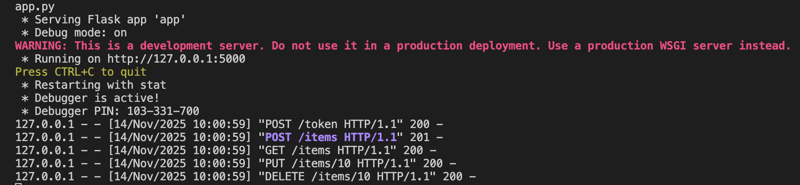
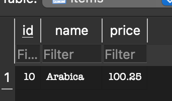
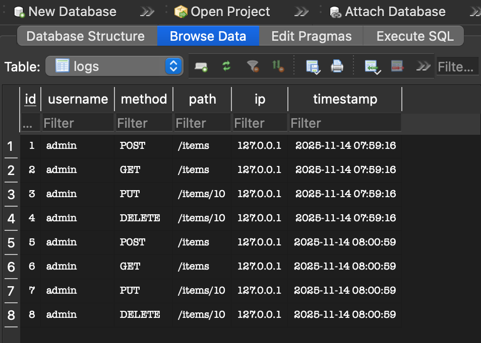
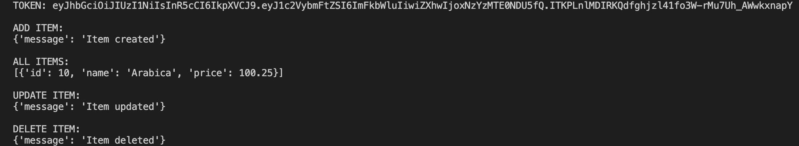
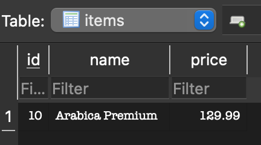

# Лабораторна робота №3  
## **Тема:** Проєктування REST API, робота з HTTP та зберіганням даних у БД  

### **Мета роботи:**  
Ознайомитися з принципами побудови REST API, створити веб-сервіс на Python (Flask), реалізувати автентифікацію через JWT, забезпечити зберігання даних у SQLite, логування HTTP-запитів та створити клієнтський застосунок для взаємодії з API.

---

# Хід роботи

---

## Завдання 1. Реалізація REST API на Flask

**Файл:** `app.py`  
**Бібліотеки:** `Flask`, `sqlite3`, `jwt`, `datetime`

**Функціонал API:**

- `POST /token` — отримання JWT токена  
- `GET /items` — список товарів  
- `POST /items` — створення товару  
- `GET /items/<id>` — перегляд товару  
- `PUT /items/<id>` — оновлення  
- `DELETE /items/<id>` — видалення  

**Приклад фрагменту серверного коду:**

```python
token = jwt.encode(
    {
        "username": username,
        "exp": datetime.datetime.now(datetime.UTC) + datetime.timedelta(hours=2)
    },
    SECRET_KEY,
    algorithm="HS256"
)
```

**Результат запуску Flask-сервера:**



---

## Завдання 2. Зберігання даних у SQLite

**Файл:** `db.py`  
**Файл SQL-моделі:** `models.sql`  
**Таблиці:**

- `users(username, password)`
- `items(id, name, price)`
- `logs(id, username, method, path, ip, timestamp)`

Приклад — **додавання нового товару**:



---

## Завдання 3. Реалізація JWT-автентифікації

Авторизація реалізована через:

```
Authorization: Bearer <token>
```

**Приклад коду перевірки токена:**

```python
data = jwt.decode(token, SECRET_KEY, algorithms=["HS256"])
username = data["username"]
```

---

## Завдання 4. Логування HTTP-запитів у базу даних

Усі запити зберігаються у таблиці `logs`:

- користувач  
- метод  
- шлях  
- IP  
- час (timestamp)

**Приклад вмісту logs:**



---

## Завдання 5. Клієнт для REST API на Python (`requests`)

**Файл:** `client.py`  
**Бібліотека:** `requests`

Клієнт виконує:

- отримання токена  
- додавання товару  
- читання всіх товарів  
- оновлення товару  
- видалення товару  

**Фрагмент коду клієнта:**

```python
token = get_token("admin", "1234")
print(add_item(token, {"id": 10, "name": "Arabica", "price": 100.25}))
print(get_items(token))
print(update_item(token, 10, {"name": "Arabica Premium", "price": 129.99}))
print(delete_item(token, 10))
```

**Приклад роботи клієнта:**



**Оновлений запис у БД:**



---

# Висновки

У ході виконання лабораторної роботи було розроблено повноцінний REST API веб-сервіс на Flask із підтримкою SQLite та JWT-автентифікації. Реалізовано всі необхідні CRUD-операції для роботи з каталогом товарів, а також систему логування HTTP-запитів у базу даних. Створено клієнт на Python із використанням бібліотеки `requests`, який продемонстрував коректність роботи всіх ендпоінтів. Робота дала змогу закріпити навички створення веб-сервісів, роботи з протоколом HTTP, обробки JSON-даних, використання БД SQLite та реалізації сучасних механізмів авторизації.

---

## 🧑‍💻 Автор  
**Ім'я:** *Yaroslav*  
**Дата виконання:** 14.11.2025
