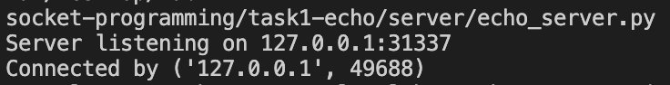
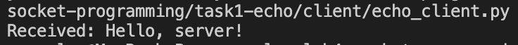
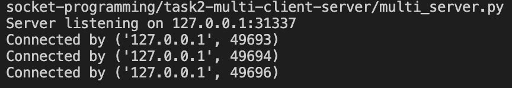
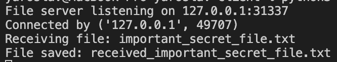

# Лабораторна робота №4  
## **Тема:** TCP Socket API у Python

### **Мета роботи:**  
Ознайомлення з принципами роботи TCP-сокетів, моделювання клієнт–серверної взаємодії, передача файлів та робота з декількома клієнтами.

---

## Хід роботи

## Завдання 1. Echo-сервер і Echo-клієнт
**Файли:**  
`task1-echo/server/echo_server.py`  
`task1-echo/client/echo_client.py`

**Результат:**  
Сервер обробляє підключення від одного клієнта.

  

---

## Завдання 2. Багатоклієнтський TCP-сервер
**Файл сервера:**  
`task2-multi-client-server/multi_server.py`

У цьому завданні **використовується той самий клієнт**, що був реалізований у **Завданні 1** — файл:

`task1-echo/client/echo_client.py`

Його достатньо запустити кілька разів, щоб протестувати роботу багатоклієнтського сервера.

**Результат:**  
Сервер обробляє послідовні підключення від багатьох клієнтів.

---

## Завдання 3. Передача файлів через TCP
**Файли:**  
`task3-file-transfer/server/file_server.py`  
`task3-file-transfer/client/file_client.py`

**Результат:**  
Клієнт передає файл *important_secret_file.txt*, сервер зберігає його як *received_important_secret_file.txt*.

  

---

## Висновки
У роботі реалізовано echo-взаємодію, багатоклієнтську модель та передавання файлів. Закріплено знання про роботу TCP, сокетів, обробку даних та взаємодію клієнт–сервер у Python.

---

## 🧑‍💻 Автор
**Ім'я:** Yaroslav  
**Дата виконання:** 21.11.2025
